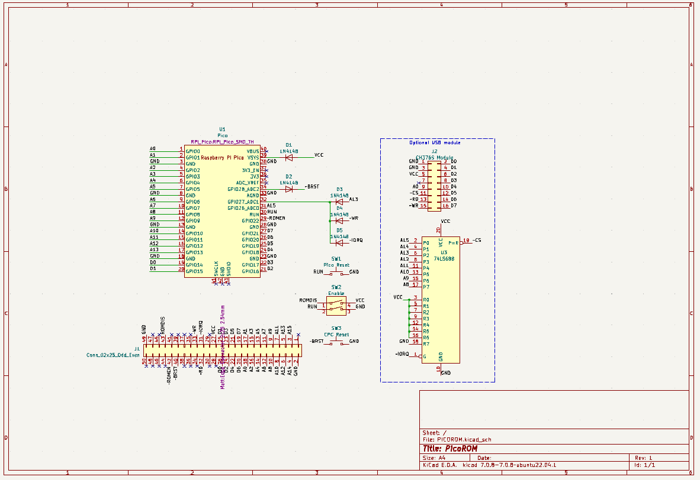
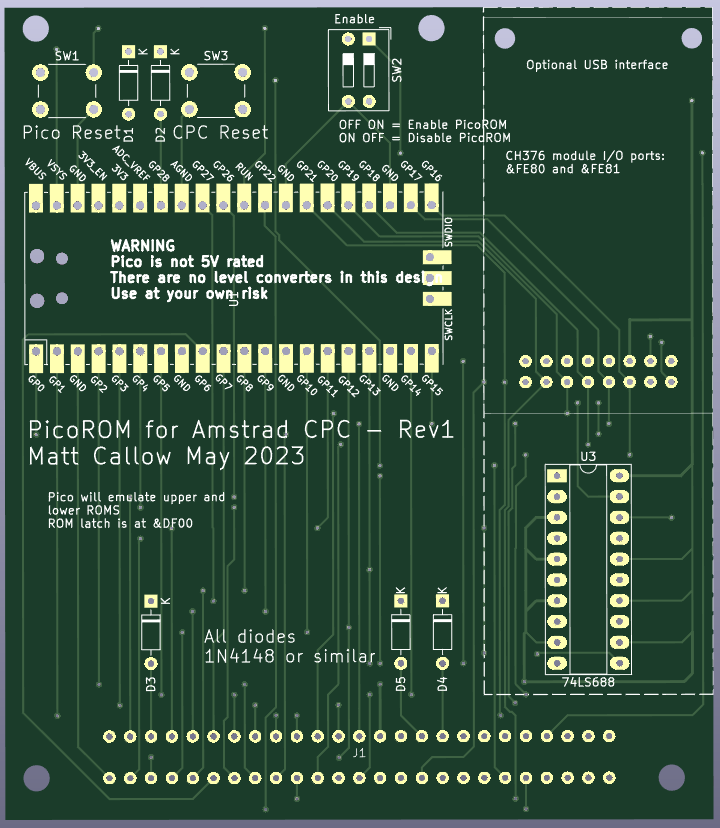

CPC ROM Emulator using Pi Pico

## Quickstart

### To load the firmware image:
* Press and hold the bootsel button on the pico and  plug the pico into a PC. It should appear as a USB drive alled RPI-RP2.
* Copy the firmware image firmware/cpc_rom_emulator.uf2 onto the Pico USB drive

You have now programed your Pico. It should reboot and appear a USB drive called PICOROM with about 1.5MB capacity.   

### Obtain ROM images
You will need some CPC ROM images. You will also need the picorom.rom file, which is in the firmware directory. 
The ROM images need to be plain ROM dumps, with no additional headers. They should be 16384 bytes in size. There are many ROM iamges available here https://www.cpcwiki.eu/index.php/ROM_List
Be careful as some of these images contain an additional header, which you will need to remove first.  
* Copy your ROM images onto the PICOROM USB drive

As a minimm you will need OS_6128.ROM and BASIC_1.1.ROM. You should also add picorom.rom 

At this point, you can test your PICOROM by unplugging the USB cable and plugging it into your CPC. If all is well, the CPC shold boot into Basic 1.1

### Create config files

You can create config files from the PC to define what ROMS to load. These files consist of one or more lines like this:

```
<SLOT>:<ROMFILE>
```

Where <SLOT> = L for lower ROM or 0-9 for upper ROM bank
<ROMFILE> = the filename of the ROM to load

For example:
```
# Default config
L:OS_6128.ROM
0:BASIC_1.1.ROM
1:picorom.rom
2:maxam15.ROM
3:Protext.rom
4:Utopia_v1_25b.ROM
5:Manic_Miner.rom
6:Chuckie.rom
```

At startup, if the Pico finds a file called DEFAULT.CFG it will load that.


### ROM Commands

If you have loaded the picorom.rom, the you get some new commands on the CPC which let you control the board:

* |PUSB - start emulating a USB drive. CPC will stpo working.
* |LED,n - Control the PICO LED n=1 for on, n=0 for off
* |ROMSET,"<config file>" - load a new config from the Pico.
* |PDIR - list all available ROMS on the Pico
* |ROMS - List currently inserted ROMs 
* |ROMOUT,n - remove a ROM from slot n

# More details


|Signal     |GPIO         |CPC Pin|Pico Pin          |
|-----------|-------------|-------|------------------|
|A0-A13     |GPIO0-GPIO13 |18-5   |1-2,4-7,9-12,14-17|
|D0-D7      |GPIO14-GPIO21|26-19  |19-22,24-27       |
|~ROMEN     |GPIO22       |42     |29                |
|ROMDIS     |-            |43     |-                 |
|A15        |GPIO26       |3      |31|
|WRITE_LATCH|GPIO27       |-      |32|
|CPC RESET  |GPIO28       |40*    |34|
|Pico RESET |-            |-      |30|


\* GPIO28 connected to CPC RESET via a diode
```
CPC RESET __|\_|___ GPIO28
            |/ |

```
CPC Reset also has a push button to 0V


WRITE_LATCH signal is created using a Diode-OR gate:
```
  A13 __|\|___
        |/|  |
             |
  ~WR __|\|__|____  WRITE_LATCH (GPIO27)
        |/|  |
             |
~IORQ __|\|__|
        |/|
```
All diodes IN4148 or similar. Pulldown provided by GPIO pin.

ROMDIS is connected to 5V

Pico is powered from 5V via a IN4148 diode to VSYS


Pico Reset is a push button to 0V

## Notes

At startup, ROMs are loaded into RAM arrays, the the second core emulates all ROM
The first core handles the ROM latch at 0xDFxx with the help of a PIO state machine. The same IO port is also used to send commands to the PICO. This is done by writing a series of bytes to the port, startign with a 0xfc (which I don't think is a valid ROM number). Format is as follows:
* 0xfc - cmd prefix
* cmd byte
* 0 to 4 parameter bytes

Data is sent from the PICO to the CPC via a 0xff byte area in the ROM at 0xC100. Format is as follows:
* sequence number - incremented when the PICO has completed the command
* status code. 0=OK
* data type. 1 = null terminated string
* data ( 0 or more bytes)

There is a CPC ROM which provides a control over the ROM emulator.


## PCB
**WARNING** There is an error on the schematic and PCB silkscreen. D2 is reversed. So, if you are going to build this, make sure that you insert D2 with the cathode (stripe) at the bottom.
----
There is a schematic and PCB layout which includes an optional USB interface.



My PCBs were made by PCBWay. The [gerbers](hardware/gerbers.zip) I used are also avalilable.


## Error Codes

If the LED flashes on the Pico, something went wrong:  
* 4 flashes = Failed to load OS ROM
* 5 flashes = Failed to load Basic ROM

